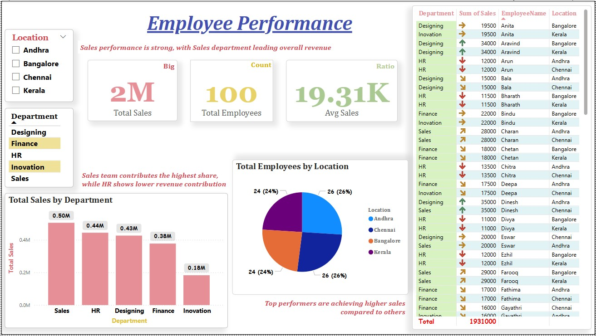

# Employee-Dashboard
Employee Performance Dashboard using Power BI

## 📊 Overview
This project analyzes employee performance and sales distribution across departments and locations.

## 🎯 Objectives
- Track total sales and employee count  
- Analyze department-wise performance  
- Compare employee distribution by location  

## ⚙️ Features
- KPI Cards (Total Sales, Avg Sales, Total Employees)  
- Bar Chart (Sales by Department)  
- Pie Chart (Employees by Location)  
- Interactive Slicers  

## 📈 Key Insights
- Sales department leads revenue contribution  
- HR shows lower sales compared to other departments  
- Workforce is balanced across locations  

## 🛠 Tools Used
- Power BI  
- Excel  

## 📸 Dashboard Preview

